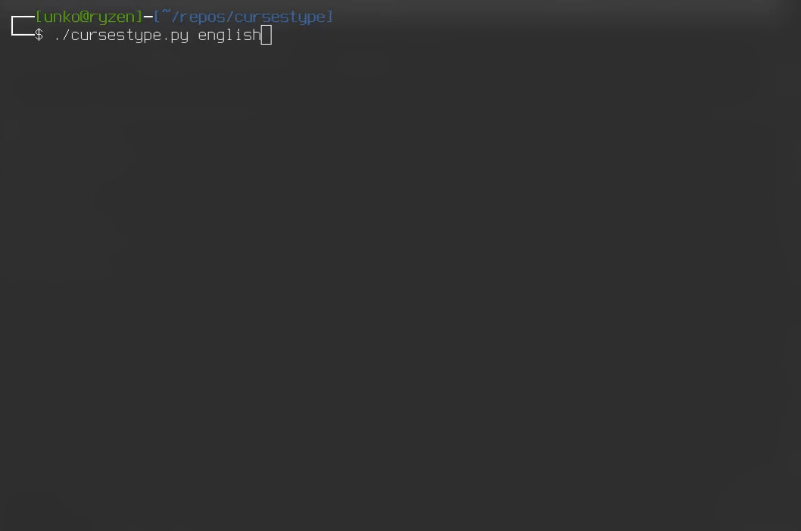

# Cursestype

## About
* A bad [MonkeyType](https://monkeytype.com) (or any generic WPM typing tester app) clone build exclusively using Python's built-in `curses` wrapper.
* Work in progress.

### (Obligatory) current state screenshot


## Motivation
* Just for fun & learning about ncurses

## Requirements
* Python > 3.7
### Why `curses`
* It's built-in and no external dependencies are required.

## Usage
So far it's just:
### Start with language wordlist (stored in words/*.py):
```bash
$ chmod +x cursestype.py
./cursestype.py czech
```
Note: `curses` is not supported in Windows `cmd.exe`, use Windows Subsystem for Linux.

## Limitations
* Only supports Latin alphabet languages

## TODO
- [ ] keep a dictionary of currently OK chars
- [ ] don't let user go back a word if he commits it (space) like MonkeyType doesn't (Confidence mode?)
- [x] if a user backspaces a green thing (a CORRECT char), make it gray again
- [ ] Multiline w.move()s - SOME work done
  - [x] refactor this, need to be able to go back to previous line
  - [ ] refactor this, needs to be dynamic! 
        - how about it uses the "keep a dictionary of currently OK chars" to rebuild?
        - with of course, also proper w.move()
    - [ ] with dynamic i also mean maybe CONSIDER: Do it like monkeytype where two lines are visible, then third, but the active one after finishing the 1st one is ALWAYS the 2nd one and they scroll up (this is true for timed, for set ones the last line is obviously finished as well on screen)
    
- [ ] newlines only as text wrapping
- [ ] don't count newlines as a character
- [ ] Menu to change language file etc.
- [ ] Let user specify a text file to load to type OR just generate words from language files that user selects
- [x] Languages other than ANSI english
- [ ] Reafctor language files system
- [ ] Command line parameters
- [ ] Timed gamemode (15s/30s/45s/60s)
- [ ] Record & replay the run (and save replays?)
- [ ] Put the text into seperate curses window!!!!
    - [ ] Stop refreshing the whole win (`w`) to get rid of flashes(?)
